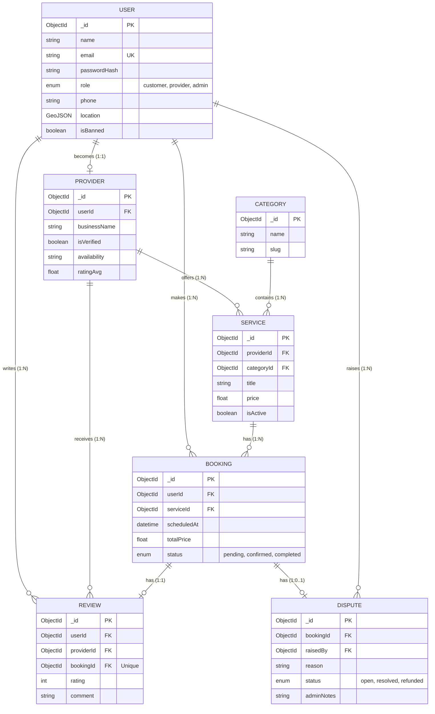

# TaskFlow Entity Relationship Diagram

This document contains the Entity Relationship (ER) Diagram for the TaskFlow platform, designed for academic submission.

## ER Diagram (Mermaid)

## Entity Details & Relationships

### 1. USER
*   **_id** (PK): Unique Identifier.
*   **email**: Unique.
*   **Attributes**: name, passwordHash, role, phone, location, isBanned.
*   **Relationships**:
    *   1:1 with **PROVIDER** (optional, as User *becomes* Provider).
    *   1:N with **BOOKING** (Customer makes bookings).
    *   1:N with **REVIEW** (User writes reviews).
    *   1:N with **DISPUTE** (User raises disputes).

### 2. PROVIDER
*   **_id** (PK): Unique Identifier.
*   **userId** (FK): References `USER._id`.
*   **Attributes**: businessName, isVerified, availability, ratingAvg.
*   **Relationships**:
    *   1:N with **SERVICE** (Provider offers services).
    *   1:N with **REVIEW** (Provider receives reviews).

### 3. CATEGORY
*   **_id** (PK): Unique Identifier.
*   **Attributes**: name, slug.
*   **Relationships**:
    *   1:N with **SERVICE** (Category contains services).

### 4. SERVICE
*   **_id** (PK): Unique Identifier.
*   **providerId** (FK): References `PROVIDER._id`.
*   **categoryId** (FK): References `CATEGORY._id`.
*   **Attributes**: title, price, isActive.
*   **Relationships**:
    *   1:N with **BOOKING** (Service has bookings).

### 5. BOOKING
*   **_id** (PK): Unique Identifier.
*   **userId** (FK): References `USER._id`.
*   **serviceId** (FK): References `SERVICE._id`.
*   **Attributes**: scheduledAt, totalPrice, status.
*   **Relationships**:
    *   1:1 with **REVIEW** (Booking has max one review).
    *   1:0..1 with **DISPUTE** (Booking has optional dispute).

### 6. REVIEW
*   **_id** (PK): Unique Identifier.
*   **userId** (FK): References `USER._id`.
*   **providerId** (FK): References `PROVIDER._id`.
*   **bookingId** (FK): References `BOOKING._id` (Unique).
*   **Attributes**: rating, comment.

### 7. DISPUTE
*   **_id** (PK): Unique Identifier.
*   **bookingId** (FK): References `BOOKING._id`.
*   **raisedBy** (FK): References `USER._id`.
*   **Attributes**: reason, status, adminNotes.
